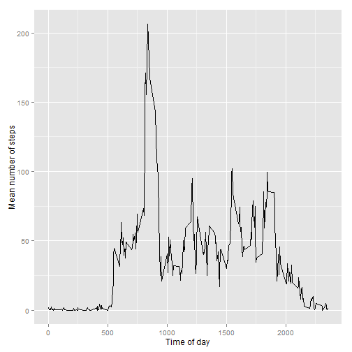
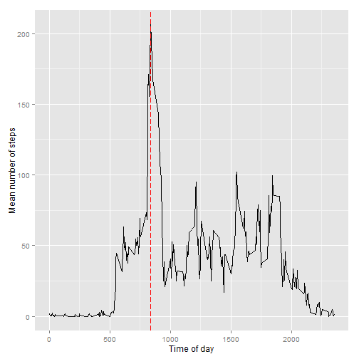
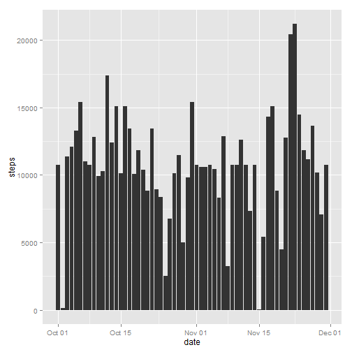
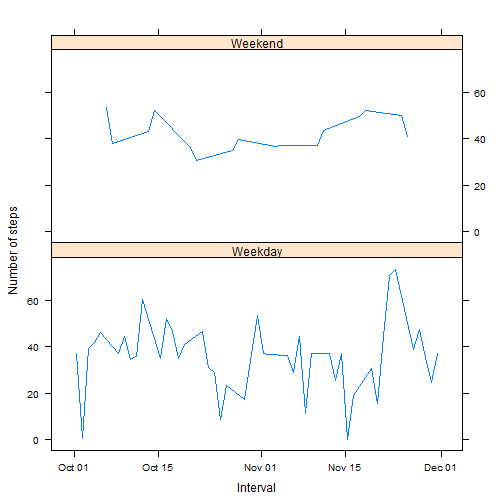

###Important notes before running script: 
1. Download and unzip file to working directory of RStudio
2. File name will be activity.csv
3. Install packages lubridate, ggplot2, dplyr, lattice

###Loading and preprocessing the data


```r
# load packages
library(lubridate)
library(ggplot2)
library(dplyr)
library(lattice)

# load file into system
activity <- read.csv("activity.csv", 
                     colClasses = c("numeric", "character","numeric"))

# convert to date time format for date column
activity$date=ymd(activity$date)
```

###Histogram of the total number of steps taken each day


```r
# use dplyr method to sum steps by date and rename the column names
total_steps=activity %>% group_by(date) %>% summarise(sum(steps,na.rm = TRUE))
colnames(total_steps) = c("date","steps")

# make a histogram of the total number of steps taken each day
ggplot(total_steps,aes(x=date,y=steps)) + geom_histogram(stat="identity")
```

 

###Mean and median number of steps taken each day


```r
# calculate and report Mean total number of steps taken per day
mean(total_steps$steps)
```

```
## [1] 9354
```

```r
# calculate and report Median total number of steps taken per day
median(total_steps$steps)
```

```
## [1] 10395
```

### Time series plot of the average number of steps taken (averaged across all days) versus the 5-minute intervals


```r
# using dplyr method, group by interval, calculate mean of steps and rename columns
data_mean = activity %>% group_by(interval) %>% summarise(mean(steps,na.rm = TRUE))
colnames(data_mean) = c("interval","mean")

# create the time series plot
ggplot(data_mean,aes(x=interval,y=mean)) + geom_line() + xlab("Time of day") + ylab("Mean number of steps") 
```

 

### Report the 5-minute interval that, on average, contains the maximum number of steps


```r
# use filter function to see highest mean. The answer is 835 as seen below:
max_interval=filter(data_mean, mean == max(mean))[1]
max_interval
```

```
## Source: local data frame [1 x 1]
## 
##   interval
## 1      835
```

To proof that the interval is correct, the highest mean step is denoted with a vertical line as shown below.

It shows the intersection with the highest point.

```r
ggplot(data_mean,aes(x=interval,y=mean)) + geom_line() + xlab("Time of day") + ylab("Mean number of steps") + geom_vline(xintercept = as.numeric(max_interval), colour="red", linetype = "longdash") 
```

 

###Imputing missing values

###Calculate and report the total number of missing values in the dataset 


```r
# To find out the number of missing values, the command belows uses the summary command.
# The 7th item refers to the number of NA's, which is equivalent to the number of missing value.
summary(activity$steps)[7]
```

```
## NA's 
## 2304
```

###Code strategy for imputing missing data

The strategy will be to assign the missing intervals with the mean value of the respective intervals.


```r
# calculate the mean of each interval and rename columns 
data_mean = activity %>% group_by(interval) %>% summarise(mean(steps,na.rm = TRUE))
colnames(data_mean) = c("interval","mean")

# loop the data set, seek those missing values replace them with mean values

# create temp copy
activity_temp = activity

# loop data set
for(n in 1:nrow(activity_temp))
{
  # find those with NA
  if(is.na(activity_temp[n,1]) == TRUE)
  {
    
    # seek the correct mean value
    value_to_set = filter(data_mean,interval == activity_temp[n,3])
    
    # replace null value with new mean value
    activity_temp[n,1] = value_to_set$mean
    
  }
  
}
```

###Histogram of the total number of steps taken each day after missing values were imputed


```r
# show header summary of new dataset to showcase that empty fields are filled
head(activity_temp)
```

```
##     steps       date interval
## 1 1.71698 2012-10-01        0
## 2 0.33962 2012-10-01        5
## 3 0.13208 2012-10-01       10
## 4 0.15094 2012-10-01       15
## 5 0.07547 2012-10-01       20
## 6 2.09434 2012-10-01       25
```

```r
# convert to date time format for date column
activity_temp$date=ymd(activity_temp$date)

# plot histogram
ggplot(activity_temp,aes(x=date,y=steps)) + geom_histogram(stat="identity")
```

 

###Mean and median total number of steps taken per day after missing values were imputed

```r
# use dplyr method to sum steps by date and rename the column names
total_steps1=activity_temp %>% group_by(date) %>% summarise(sum(steps,na.rm = TRUE))
colnames(total_steps1) = c("date","steps")

# calculate mean
mean(total_steps1$steps)
```

```
## [1] 10766
```

```r
# calculate median
median(total_steps1$steps)
```

```
## [1] 10766
```

###Do these values differ from the estimates from the first part of the assignment? 

Yes, the outcome is different as those empty values are now populated with mean values of the intervals. 

###What is the impact of imputing missing data on the estimates of the total daily number of steps?

There is an implication on the mean and media. 

The mean and median of the new data set are similar to each other.

However the mean and median of the new data are now higher than the mean and median of the original data.

###Following section contain codes to compare differences in activity patterns between weekdays and weekends:


```r
# Create a new factor variable in the dataset with two levels -- "weekday" and "weekend" indicating whether a given date is a weekday or weekend day.

# create a new column to determine day name
activity_temp1= mutate(activity_temp,
                       day_type=weekdays(activity_temp[,2]))


# convert from factor to character type of the new column
activity_temp1[,4]=as.character(activity_temp1[,4])

# loop column to replace values of new column to Weekend or Weekday
for(n in 1:nrow(activity_temp1))
{
  if(activity_temp1[n,4] == 'Sunday' ||  activity_temp1[n,4] == 'Saturday' )
  {
    # set to weekend
    activity_temp1[n,4] = "Weekend"    
  }
  else
  {
    # set to weekend
    activity_temp1[n,4] = "Weekday"    
    
  }
}

# set column class of new column to factor
activity_temp1$day_type=as.factor(activity_temp1$day_type)

# view data set
str(activity_temp1)
```

```
## 'data.frame':	17568 obs. of  4 variables:
##  $ steps   : num  1.717 0.3396 0.1321 0.1509 0.0755 ...
##  $ date    : POSIXct, format: "2012-10-01" "2012-10-01" ...
##  $ interval: num  0 5 10 15 20 25 30 35 40 45 ...
##  $ day_type: Factor w/ 2 levels "Weekday","Weekend": 1 1 1 1 1 1 1 1 1 1 ...
```

###Panel plot comparing the average number of steps taken per 5-minute interval across weekdays and weekends


```r
# use dplyr method to sum steps by date and rename the column names
final_plot=activity_temp1 %>% group_by(day_type,date) %>% summarise(mean(steps,na.rm = TRUE))
colnames(final_plot) = c("day_type","date","mean_steps")

# plot via lattice function xyplot
xyplot(mean_steps ~ date | day_type , final_plot, type = "l", layout = c(1, 2),
       xlab = "Interval", ylab = "Number of steps")
```

 
